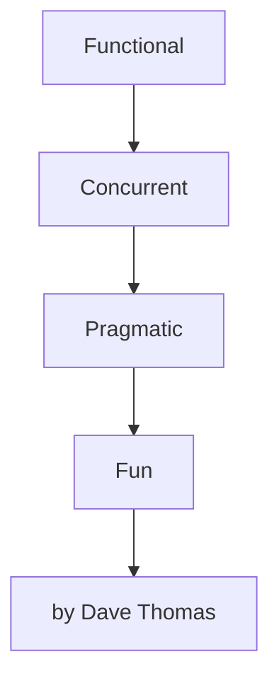
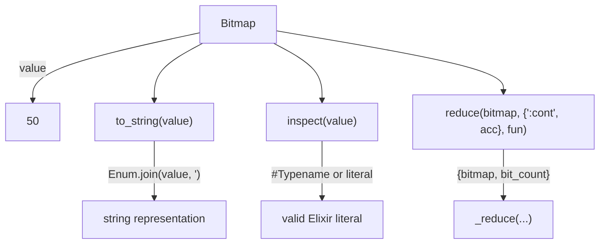
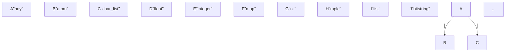

# Broken Diagrams Analysis

**Date**: 2025-11-26 (Latest Import)
**Total Diagrams**: 125
**Valid**: 113 (90.4%)
**Invalid**: 12 (9.6%)

*Note: 1 invalid diagram is due to browser launch failure, not syntax error.*

## Summary of Error Patterns

| Error Type | Count | Description |
|------------|-------|-------------|
| Nested quotes in edge labels | 7 | `["cat", dog]` inside already-quoted labels |
| Unquoted special chars | 2 | `@type`, `{curly braces}` without quotes |
| Empty/malformed node syntax | 2 | `A"any"` instead of `A["any"]` |
| Unquoted single quotes | 1 | Single quote inside edge label |

---

## Invalid Diagrams Detail

### 1. Programming Elixir Concepts (BROWSER ERROR - NOT SYNTAX)

**ID**: `2558ab44-32ca-43ce-bee4-3d2ab133873c`

**Error**: Failed to launch browser (puppeteer issue, not diagram syntax)

**Source**:


**Note**: This diagram is actually valid - the error is from puppeteer, not mermaid.

---

### 2. List Comprehensions in Elixir

**ID**: `f75980ed-af45-412f-b2df-fd86d5e9c84f`

**Error**: Parse error on line 2 - nested quotes `["cat", dog]`

**Source**:
```mermaid
flowchart TD;
    A["Input List"] -->|"["cat", dog]"| B["Comprehension"];
    B -->|"String.upcase(name)"| C["Result List"];
    C -->|"["CAT", DOG]"| D["Output"];
    A -->|"into: %{}"| E["Map Comprehension"];
    E -->|"{x, String.upcase(x)}"| F["Result Map"];
    F -->|"%{"cat" => "CAT", "dog" => DOG}"| D;
    G["Example Usage"] -->|"for x <- ~w{cat dog}"| E;
```

**Issue**: Edge labels contain unescaped quotes inside quoted strings.

---

### 3. Structs and Modules in Elixir

**ID**: `be8d5023-363e-4195-b4d5-149157442d3c`

**Error**: Parse error on line 3 - empty string in node `""`

**Source**:
```mermaid
flowchart TD
    A["Module: Attendee"] --> B["defstruct"]
    B --> C["name: ""]
    B --> D["paid: false"]
    B --> E["over_18: true"]
    A --> F["Function: may_attend_after_party"]
    A --> G["Function: print_vip_badge"]
    C -->|"{ a_name, over_18, paid }"| H["Pattern Match"]
    H -->|"a_name"| I["Access Field"]
```

**Issue**: `C["name: ""]` has nested quotes creating empty string.

---

### 4. Regex Operations in Elixir

**ID**: `4911cf96-ba97-49e7-8b38-f5e9deecd016`

**Error**: Parse error on line 4 - nested brackets and quotes

**Source**:
```mermaid
flowchart TD
    A["Regex.run"] -->|"[1]"| B["Result"]
    A -->|"input"| C[""caterpillar""]
    D["Regex.scan"] -->|"[["a"], ["e"], ["i"], [a]]"| E["Results"]
    D -->|"input"| C
    F["Regex.split"] -->|"["c", "t", "rp", "ll", r]"| G["Parts"]
    F -->|"input"| C
    H["Regex.replace"] -->|"c*t*rp*ll*r"| I["Replaced"]
    H -->|"input"| C
```

**Issue**: `[["a"], ["e"], ["i"], [a]]` has nested brackets and quotes.

---

### 5. Enum Functions Overview

**ID**: `28d8becb-ee4b-4a01-8a18-fc9972b96416`

**Error**: Parse error on line 3 - nested quotes with comma

**Source**:
```mermaid
flowchart TD
    A["split_while(list, &(&1 < 4))"] -->|"{[1, 2, 3], [4, 5]}"| B["Enum.join(list)"]
    B -->|"12345"| C["Enum.join(list, ", ")"]
    C -->|"1, 2, 3, 4, 5"| D["Predicate Operations"]
    D -->|"Enum.all?(list, &(&1 < 4))"| E["false"]
    D -->|"Enum.any?(list, &(&1 < 4))"| F["true"]
    D -->|"Enum.member?(list, 4)"| G["true"]
    D -->|"Enum.empty?(list)"| H["false"]
    D -->|"Enum.zip(list, [:a, :b, :c])"| I["[{1, :a}, {2, :b}, {3, :c}]"
```

**Issue**: `C["Enum.join(list, ", ")"]` has nested quotes with comma.

---

### 6. Dict and Map Interaction in Elixir

**ID**: `9ccc9609-a9fa-4482-b5b0-17162084c724`

**Error**: Parse error on line 5 - malformed edge label

**Source**:
```mermaid
flowchart TD
    A["Keyword List"] -->|"Enum.into"| B["HashDict"]
    A -->|"Enum.into"| C["Map"]
    B -->|"Dict.get(:likes)"| D["Programming"]
    C -->|"C[":where"]"| E["Dallas"]
    B -->|"Dict.put(:also_likes, 'Ruby')"| F["HashDict Updated"]
    F -->|"Dict.merge(C, F)"| G["Combined Map"]
    H["Pattern Matching"] -->|"%{name: a_name}"| I["Extracted: 'Dave'"]
```

**Issue**: `C[":where"]` in edge label - looks like copy/paste error from node syntax.

---

### 7. Error Handling in Elixir

**ID**: `308146bb-2d79-4260-9fbb-c2294b8b5e20`

**Error**: Parse error on line 4 - nested quotes in node label

**Source**:
```mermaid
flowchart TD
    A["File.open(user_file_name)"] -->|"{:ok, file}"| B["process(file)"]
    A -->|"{:error, message}"| C["IO.puts :stderr"]
    D["File.open!("config_file")"] -->|"Raised Exception"| E["process(file)"]
    F["case File.open("config_file")"] -->|"{:ok, file}"| G["process(file)"]
    F -->|"{:error, message}"| H["raise "Failed to open config file: #{message}"" ]
```

**Issue**: `File.open!("config_file")` has unescaped quotes inside node label.

---

### 8. Color Sigil Implementation

**ID**: `26c1fc1b-5c29-4979-b7db-4c41e9a43883`

**Error**: Parse error on line 11 - nested quotes with colon

**Source**:
```mermaid
flowchart TD
    A["ColorSigil"] --> B["@color_map"]
    B --> C["rgb"]
    B --> D["hsb"]
    A --> E["sigil_c(color_name, [])"]
    A --> F["sigil_c(color_name, 'r')"]
    A --> G["sigil_c(color_name, 'h')"]
    E --> H["_c(color_name, :rgb)"]
    F --> H
    G --> I["_c(color_name, :hsb)"]
    I --> J["@color_map[":hsb"]"]
```

**Issue**: `@color_map[":hsb"]` has nested quotes.

---

### 9. Bitmap Enumerable and String Protocols

**ID**: `54dbc26a-0813-47c5-a0b5-8e15d45222b3`

**Error**: Parse error on line 4 - unescaped single quote

**Source**:


**Issue**: `Enum.join(value, ')` has unmatched single quote.

---

### 10. Kinect Protocol Error Handling

**ID**: `a7270fcb-b323-4535-a47d-b97c88856ed3`

**Error**: Parse error on line 6 - unquoted curly braces

**Source**:
```mermaid
flowchart TD
    A[KinectProtocolError] --> B[message]
    A --> C[can_retry]
    A --> D["full_message(me)"]
    D -->|"Kinect failed: #{me.message}, retriable: #{me.can_retry}"| E[Output]
    F[try { talk_to_kinect }] -->|"rescue"| G[KinectProtocolError]
    G --> H[Output full_message]
    H -->|"if error.can_retry"| I[schedule_retry]
```

**Issue**: `F[try { talk_to_kinect }]` has unquoted curly braces.

---

### 11. Elixir Basic Types and Structures

**ID**: `daf71595-84f2-4d09-8b14-36c6f3e7fbf8`

**Error**: querySelector error - malformed node syntax

**Source**:


**Issue**: Nodes defined as `A"any"` instead of `A["any"]` - missing brackets.

---

### 12. Elixir Type Specifications and Function Signatures

**ID**: `063c7328-9465-41d9-8411-b23a65f149d2`

**Error**: Parse error on line 2 - unquoted `@` symbol

**Source**:
```mermaid
flowchart TD;
    A[@type] -->|"::"| B[type_specification];
    A -->|"parameterized"| C[type_name];
    D[@spec] -->|"function_name("| E[param_types];
    D -->|":: return_type"| F[return_type];
    G[examples] -->|"values(t)"| D;
    G -->|"size(t)"| D;
    G -->|"has_key?(t, key)"| D;
    G -->|"update(t, key, value)"| D;
```

**Issue**: `A[@type]` and `D[@spec]` have unquoted `@` symbols.

---

## Root Cause Analysis

The LLM-generated Mermaid diagrams have these common issues:

1. **Nested quotes in labels** (7 diagrams) - The LLM puts code like `["a"]` or `"string"` inside already-quoted labels without escaping
2. **Unquoted special characters** (2 diagrams) - `@`, `{`, `}` need to be inside quoted brackets
3. **Malformed node syntax** (2 diagrams) - Missing `[]` brackets around node labels
4. **Unmatched quotes** (1 diagram) - Single quotes not properly handled

## Recommended Prompt Improvements

Add these rules to the diagram generation prompt:

1. **Never use quotes inside edge labels** - Use descriptive text instead of code literals
2. **Always quote node labels** - Use `A["text"]` not `A[text]` for anything with special chars
3. **Avoid code in labels** - Use simplified descriptions instead of actual Elixir syntax
4. **Use HTML entities** - For special chars that must appear: `&quot;` for quotes, `&lbrack;` for brackets

## Scripts for Future Validation

Scripts are saved in `scripts/` directory:

```bash
# Export diagrams from database
mix run scripts/export_diagrams.exs

# Validate (run from assets folder where mermaid-cli is installed)
cd assets && node ../scripts/validate_mermaid.mjs
```

Results written to `/tmp/diagram_validation_results.json`
